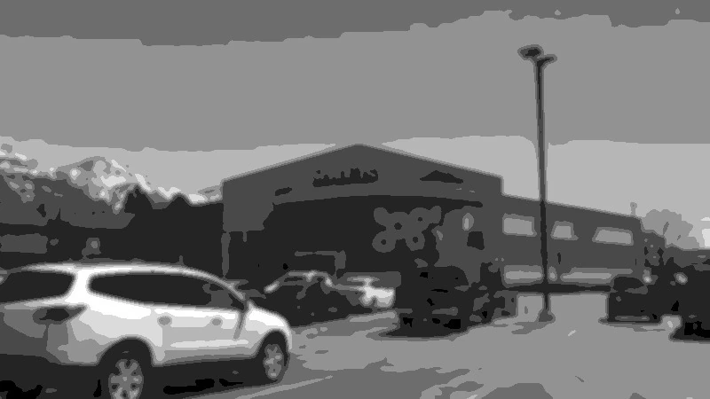
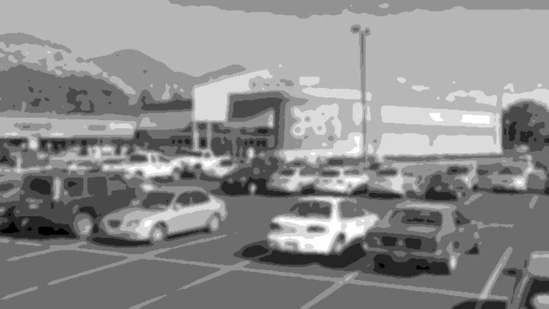
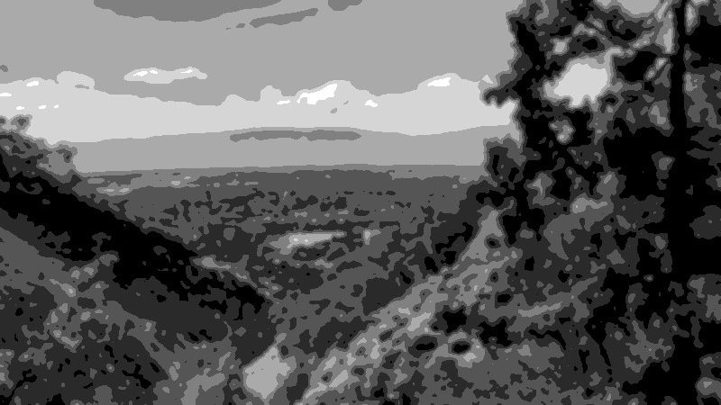
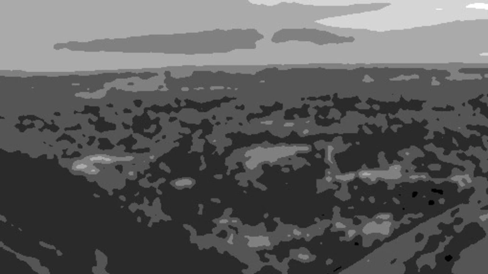
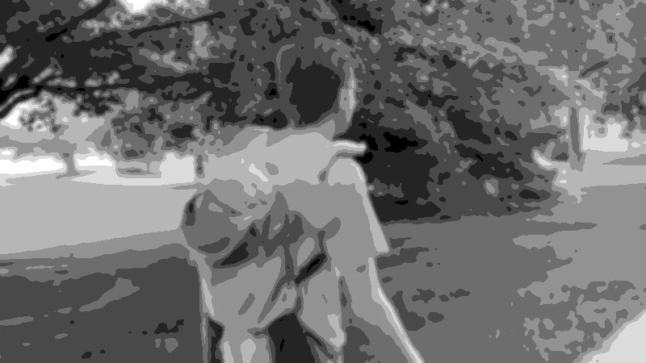
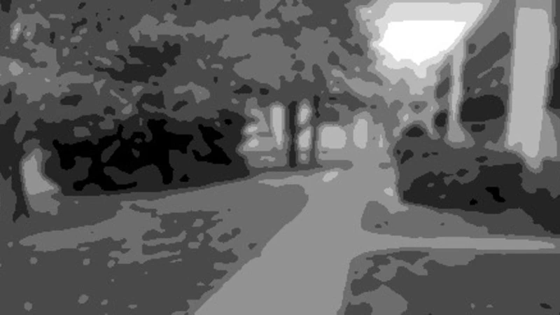
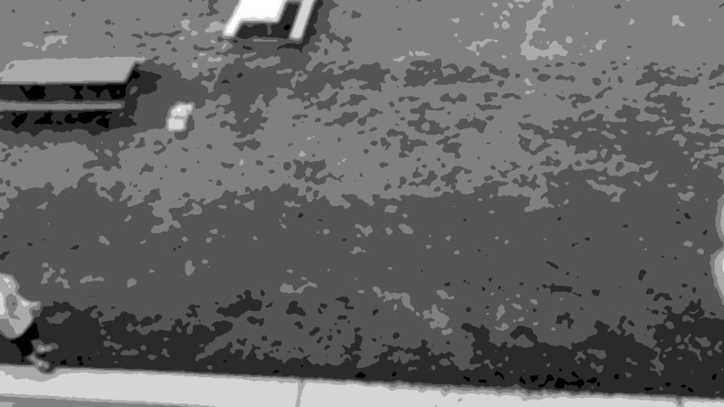
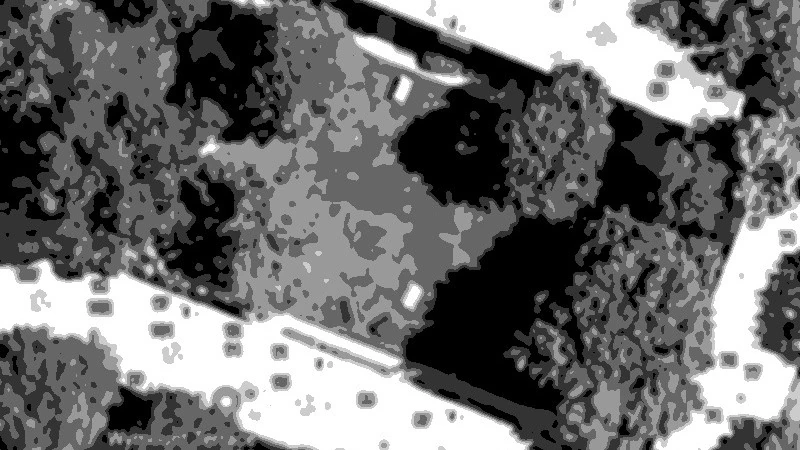

> **TL;DR**
> 
> This project reconstructs the location and inferred residence of an anonymous video publisher using only public data. Techniques used include reverse image search, satellite image correlation, video frame analysis, and low-signal social metadata enumeration.
> 
> 📁 See the `images/` folder for all processed frames used in this report.
>
> Tags: `#i3` `#osint` `#geolocation` `#recon` `#ethicalinvestigation`

# Identity and Location Resolution from Minimal Public Signals: An Ethical OSINT Case Study

## Abstract

This case study explores investigative techniques for reconstructing identity and location from extremely limited input — sparse, unstructured video publications on YouTube. It was conducted to support my professional portfolio demonstrating capability in low-signal investigative techniques, geolocation, and ethical open-source investigation relevant to cybersecurity and threat intelligence. The objective was to assess the viability of investigation methods under information poverty.

## Ethical Declaration

This investigation was conducted solely for research and professional development in performing investigations. No private systems, credentials, or restricted data sources were accessed. All analysis was performed using publicly available information at the time of research. No contact was made with the subject or their associates. The target was treated as an anonymous case and all findings are now anonymised and disclosed only for educational purposes.

## Introduction

This case study demonstrates how analysis of publicly-accessible information — including video footage, social metadata, and satellite imagery — can resolve location and identity with very low-signal input. 

In the UK, the investigative framework I will use is called 'I3' — 'Intelligence, Investigation, Inference' — which follows this information pipeline:

Raw Data → Processed Data → (Investigation) → Intelligence Report / Briefing

Processed raw public data — structured, validated, and analysed — is often referred to as 'OSINT'. Despite the name, OSINT is not intelligence in the decision-ready information sense. It is the input to the investigation, not the output.

In this case study I use this framework to reveal locations and the identity of the subject's pseudonymous YouTube profile. The profile I chose for this purpose was selected for having minimal indicators.

I will list the film shoot locations in the order that I have identified them along with the video and its timestamp of when the location was filmed. I will explain with each one how I obtained precise GPS coordinates.

This report is anonymised — locations, video titles, video timestamps, personal details and any other identifying information have not been included.

## Methodology

### Identifying Film Locations and Narrowing the Subject's Residence

1. Video A

   - Farmers' Market ~08:10

     <table>
       <tr>
         <td align="center" width="400">
            
           Posterised frame from Video A showing the storefront layout.
         </td>
         <td align="center" width="400">
            
           Posterised public image confirming feature match.
         </td>
       </tr>
     </table>

     Reverse image searching a video frame through Yandex.com provided many results, one of which I could immediately identify to be this same building, referred to as their “local” farmers’ market in the video. This provided a foothold to begin resolving other locations in the video content.

   - Pet Shop ~10:40

     Given the footage was filmed in a pet shop, I searched for pet shops near the rental property address I found earlier in Google Maps. Enumerating them all, I found one with user-submitted photos of the inside that matched the features in the video.

1. Video B

   - Canyon Trail ~12:00

     <table>
       <tr>
         <td align="center" width="400">
            
           Posterised frame from Video B showing the town from the mountain.
         </td>
         <td align="center" width="400">
            
           Posterised public image confirming feature match.
         </td>
       </tr>
     </table>

     After extracting a video frame looking down on a town from up on a mountain, I opened an image editing tool and highlighted key features such as roads and buildings.

     Now knowing the location where Video A was filmed, I opened Google Earth and positioned the view at, and pointing to, that town. I visually identified those features in the video frame from Video B in the software and aligned the view to point at them such that the view angle and position would make what I saw similar to the extracted video frame. This helped me identify a rough location it was filmed from the Google Earth's view position.

     Given the steepness of the mountainsides, I guessed that they would have taken a canyon trail to reach that position. I searched for the canyon trail that passed through the Google Earth's view position and opened it on Google Street View at the view position's location. I compared a Google user-submitted photo at that position to the video frame side-by-side in an image editing tool and the key features in the images and their perspectives matched which confirmed the video frame's location.

1. Video C

   - University-owned Housing Complex ~00:40

     The footage shows the subject walking on a pavement then it cuts to them standing outside a flat complex. I searched Google Images for "apartments in [the town from previous queries]" and found a rental property listing for an address that visually matched the outside of the complex in the video. The bench's location outside the flats differed so I couldn’t be completely confident on the match however. Further research found three other similar housing complexes with a shared garden area like this in the area so I mentally noted that the footage could've also been filmed at one of the others.

   - Softball Field ~00:30

     <table>
       <tr>
         <td align="center" width="400">
            
           Posterised frame from Video C showing subject walking near the complex.
         </td>
         <td align="center" width="400">
            
           Posterised drone footage frame as it flies through the same location.
         </td>
       </tr>
     </table>

     Now that I have the location for the more easily-identifiable scene just seconds later, I can come back to the scene of the subject walking on the pavement. As Google Street View's coverage of this area was insufficient, I searched YouTube for videos shot near the location of the housing complex in the later scene. I came across some drone footage and followed the drone's path, identifying buildings it flew past by comparing them to buildings on Google Street View. With the drone's flight trajectory mapped, I could identify the location where is flies past the same portion of pavement in Video C.

1. Narrowing Residence Cluster from Prior Observations

   - Inferring the Correct Flat Complex

     In Video C, the transition from the scene of the subject walking along a pavement outside their flat complex at ~00:30 to in the shared garden area under their balcony at ~00:40 suggests they were walking home. Using mapping tools, I notated the direction of travel and with two maps of the cluster of all four flat complexes of the same type that I had found online, it could be inferred that they lived in the northern-most complex.

   - Narrowing It Down to Just Four Flats

     <table>
       <tr>
         <td align="center" width="400">
            
           Posterised frame from Video C showing the view of the garden area from the flat's balcony.
         </td>
         <td align="center" width="400">
            
           Posterised satellite photo showing the inferred flat complex.
         </td>
       </tr>
     </table>

     In Video C, there is a shot of the subject in the shared garden area from above looking down from a balcony of one of the flats. Matching the features such as trees, benches, and the playground to a satellite photo on Google Maps, I could infer that the balcony was located on the right half of the southern-most block of flats in the complex. A brown and green bench are adjacent along with an orthogonal lighter bench. These benches roughly correspond to the same near the southern-most block however the orientations and positions slightly differ in the older satellite images.

     I looked at the positions of the paths around the garden and the subject's position relative to them to identify their position on the map in the same balcony shot in Video C. This reveals roughly where the balcony is in the southern-most block of the complex.

     Overlaying a university online map over the satellite image in an image editing tool with translucency, I inferred the flat numbers that corresponded to the balcony's rough location. Google Maps doesn't show the flat numbers correctly so I looked online and found a map by the university that owns the complexes. It was a bit cryptic on how the numbers corresponded to which flats so I looked on Google Street View which showed a plaque with flat numbers on them. The numbers were ascending vertically which corresponded to the same vertically ascending numbers on the online map. This let me deduce that the balcony was located outside one of eight flats — four on floor one and four on floor two.

     If further assumptions were made, you could infer a likely flat number however such assumptions weren't convincing.

## Conclusions

I've demonstrated that efforts to separate online personas from real-world identities can be insufficient against an ethical, motivated, and capable actor using only publicly accessible data — let alone a malicious one. I've learnt how powerful structured public data can be and how important it is to maintain robust ethics. It also gave me practical experience with geolocation, social graph resolution, and efficient investigative tree search under uncertainty.

This case study exemplifies how publicly available information can compromise anonymity and privacy, even in low-signal environments. It reinforces the importance of security auditing, minimising metadata, and privacy-aware system design.

## Data Sources Used

- YouTube video uploads
  - Video content and descriptions
  - Drone footage comparisons
- Public Colab notebooks (links contained in video upload metadata)
- Image search engines
  - Yandex Reverse Image Search
  - Google Images
- Personal metadata
  - LinkedIn, Facebook (public profiles only)
  - FastPeopleSearch (US people index)
- Maps (conventional, satellite, and 3D)
  - University-provided online housing maps
  - Google Maps / Street View / Earth

## Tools and Techniques Used

### Tools

- **Google/Yandex Reverse Image Search** — for identifying locations from frames
- **Google Dorking** — for precise control over engine searches
- **Google Earth and Google Maps** — visual correlation with terrain/building layouts
- **ImageMagick** — for posterisation, resizing, format conversion
- **Bash scripting** — for reproducible image processing
- **md5sum and identify** — to validate transformations and enforce consistency

### Techniques

- Frame-by-frame inference from video footage
- Visual feature matching across data formats (video ↔ satellite ↔ map)
- Manual geolocation using architecture and object placement
- Ethical anonymisation through data suppression and abstraction
- Posterisation for privacy-preserving visual analysis
- Markdown-based structured documentation and visual explanation
